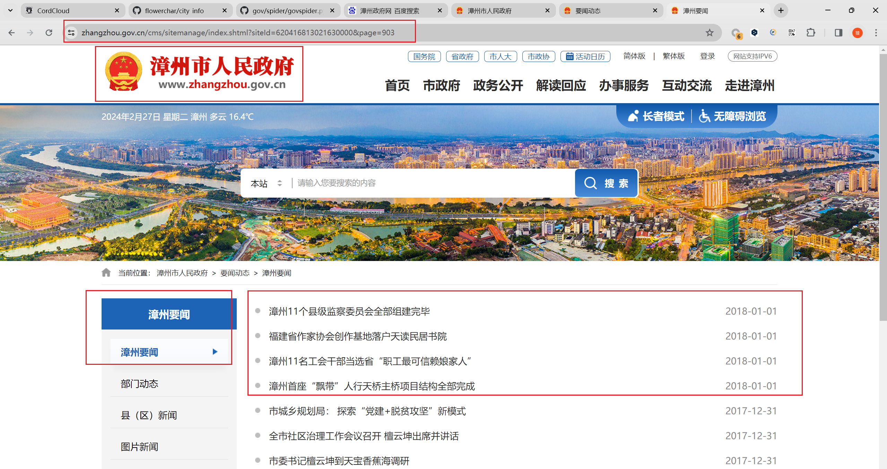
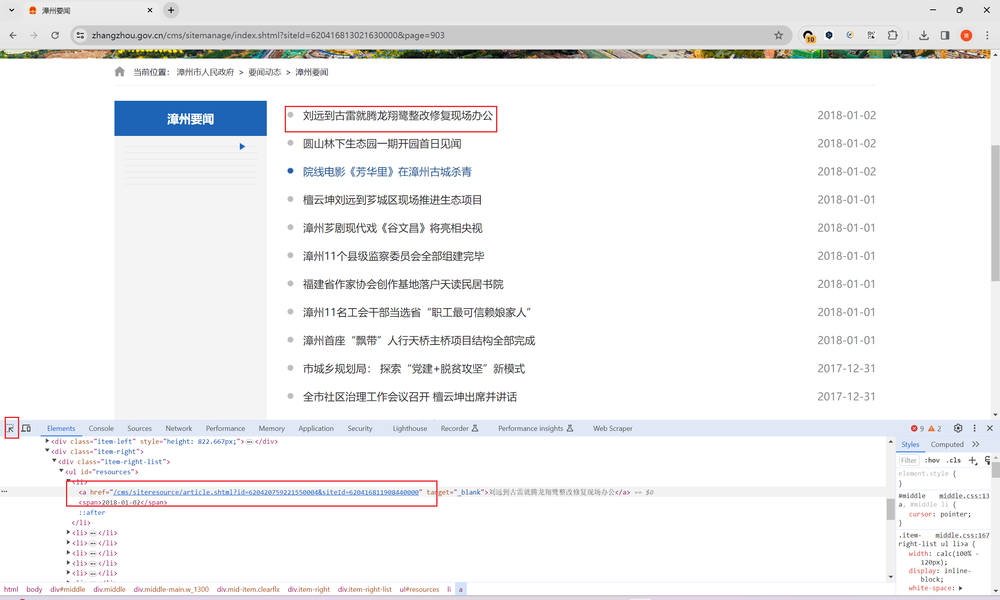
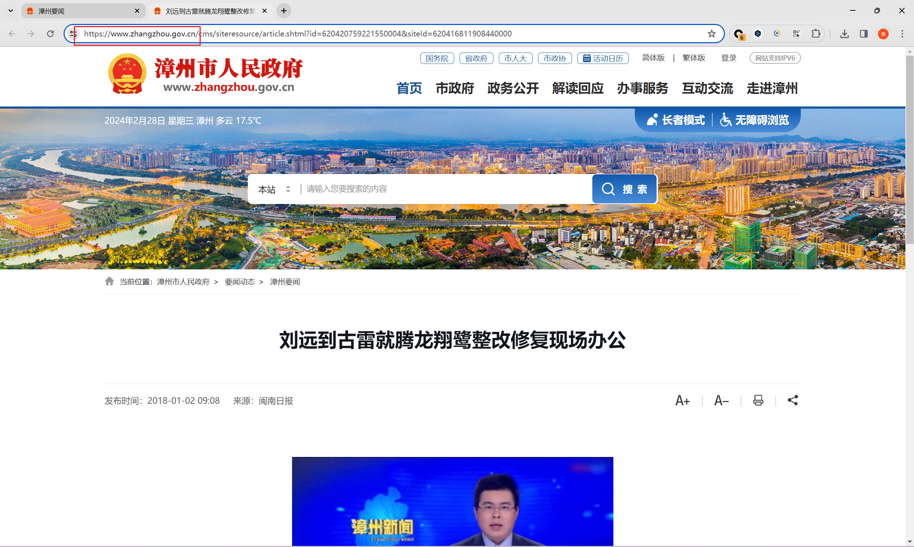
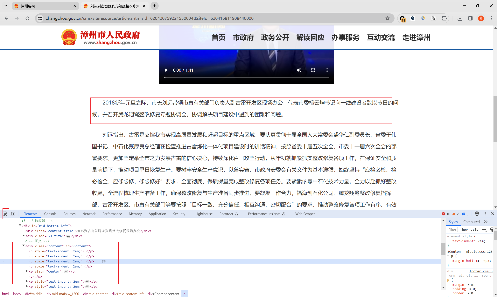
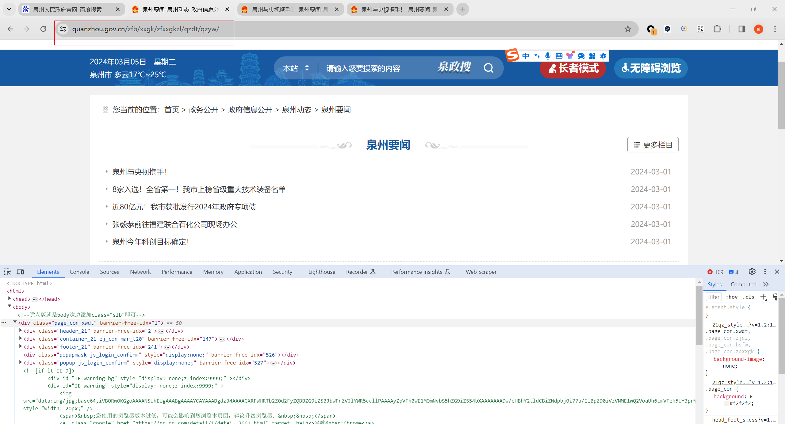
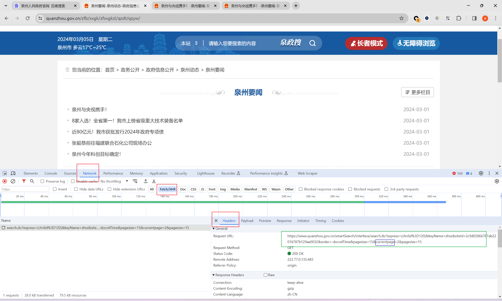
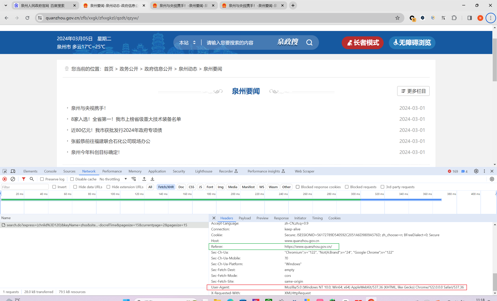
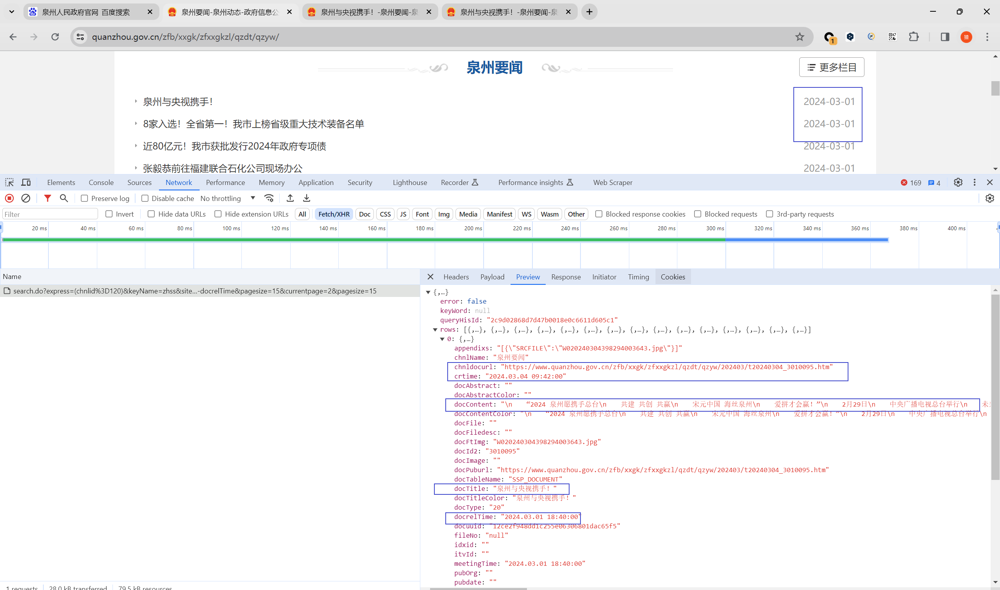
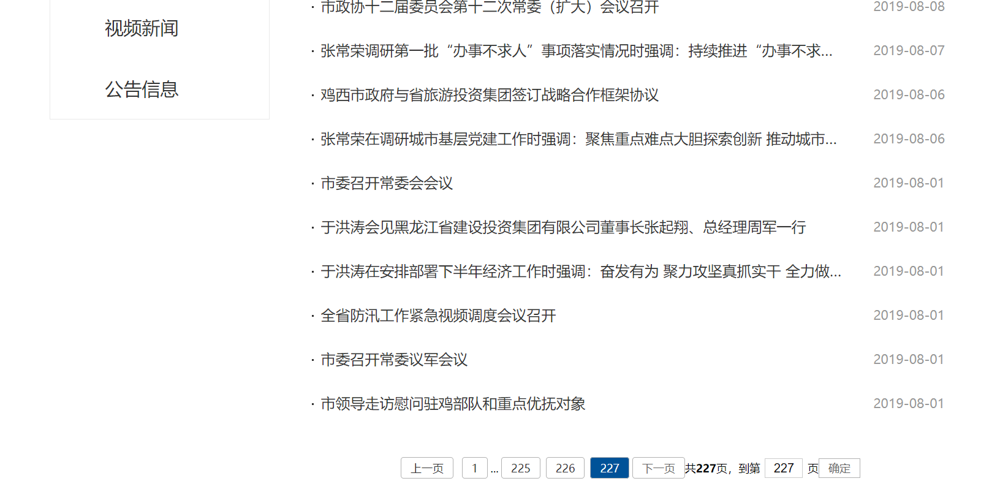

本项目以**地方政府网站**作为第一优先级

以2018年漳州市人民政府网为例：

1. 先找到城市对应的人民政府网url
2. 找到**漳州要闻**栏目
3. 在选项里找到2018年对应的起止条数，此时903页为最开始的时间，762页为截至时间
4. F12选择最右边的小箭头，点开任意条目，查看a元素的href属性并点击
5. 那么红圈内的前缀跟4中的href就组成了详情页的链接。记住这个baseUrl
6. 在详情页F12打开开发者工具，选择此页内容，可以看见所有文本都是包含在id为Content的div中

- 漳州   
  - f"https://www.zhangzhou.gov.cn/cms/sitemanage/index.shtml?siteId=620416813021630000&page={i}" 
  - '//*[@id="resources"]/li/a/text()'      
  - '//*[@id="resources"]/li/a/@href'     
  - '//*[@id="resources"]/li/span/text()'                    
  - "漳州" 
  - 'https://www.zhangzhou.gov.cn' 
  - '// *[@id="Content"]//text()' 
  - 762, 903 
  - "福建_漳州" 
- 南平   
  - f"https://www.np.gov.cn/cms/sitemanage/index.shtml?siteId=340337403813780000&page={i}" 
  - '//*[@id="resources"]/li/span/a/text()' 
  - '//*[@id="resources"]/li/span/a/@href' 
  - '//*[@id="resources"]/li/span[@class="list-time"]/text()' 
  - "南平"
  - 'https://www.np.gov.cn/' 
  - '//*[@id="Content"]//text()'                             
  - 483, 422
  - "福建_南平" 

有些城市的url可能不如上述整齐，在红圈内并没有currentPage，此时需要：

- F12打开开发者选项， 点击Network，点击Fecth/XHR，红圈即是依次点击的地方，绿圈内就是完整的url，蓝圈的字段就是要找的currentPage
- 反爬做得好的网站会有防盗链处理，在当前页面往下滚动，即可找到Referer
- 确定数据源后就是解析数据，因为这种不是静态页面，那么就用json/Python中的字典，按照key的形式取出value

- 泉州（**该城市需要在header中添加防盗链Referer**）
  - 'Referer': 'https://www.quanzhou.gov.cn/'

  - "泉州"
  
    -  f"https://www.quanzhou.gov.cn/smartSearch/interface/search.do?express=(chnlid%3D120)&keyName=zhss&siteId=2c9d02866787ab22016787b129ae0032&order=-docrelTime&pagesize=15&currentpage={i}&pagesize=15"
    
  
    - title = j['docTitle']
  
    - date = j['docrelTime'].split()[0].replace('.', '-')
  
    - href = j['docPuburl']
  
    - content = j['docContent']
  
    - 491, 607
  
    -  "福建-泉州"
  
- 三明（**数据较少**）

    - 'Referer':'https://www.sm.gov.cn/zw/zwxx/sjdt/'

    - "三明"

    - f"https://www.sm.gov.cn/fjdzapp/data?channelid=100000&sortfield=-docorderpri%2C-docreltime&classsql=chnlid%3D4064&classcol=publishyear&classnum=100&classsort=0&cache=true&page=133&prepage=75"

    - 661， 662

- 莆田市

    - 717， 910

- 厦门 无

  - 湖里  99， 105

  - 集美   28， 42

- 福州

    - 452， 547

- 绥化

    - 66， 96

- 鸡西没有数据
- 鹤岗
  - 498， 569
- 大庆没有
- 伊春
  - 友好区
    - 91， 108
  - 金林区
    - 75，138
  - 南岔
    - 77，125
  - 嘉荫
    - 368,431
  - 铁力
    - 68，94
- 佳木斯
  - 412，533
- 七台河
  - 119，128
